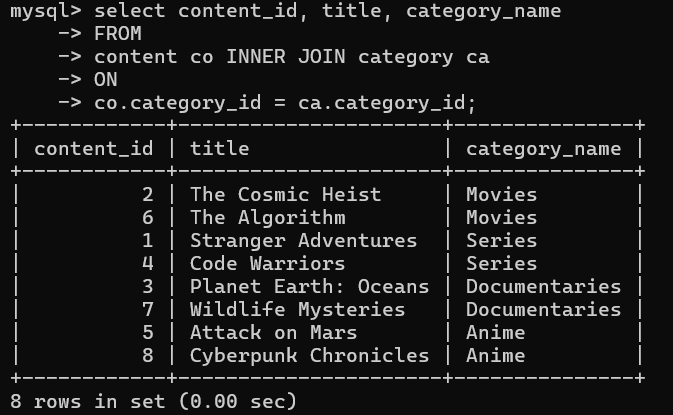
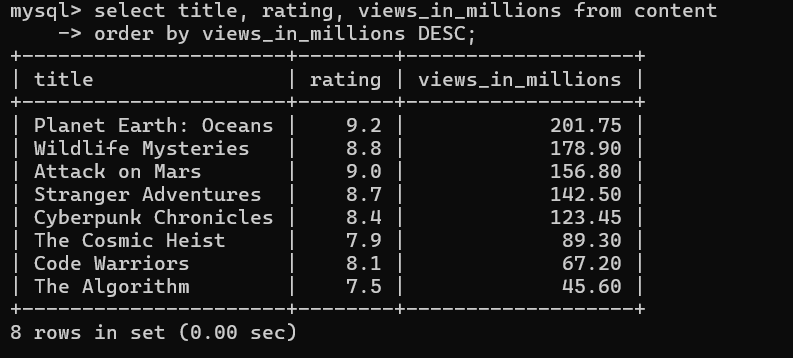
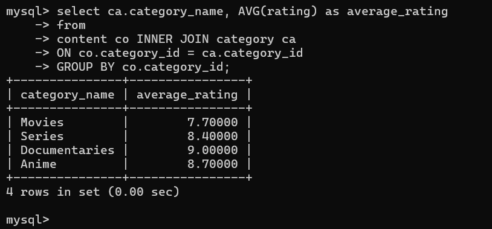
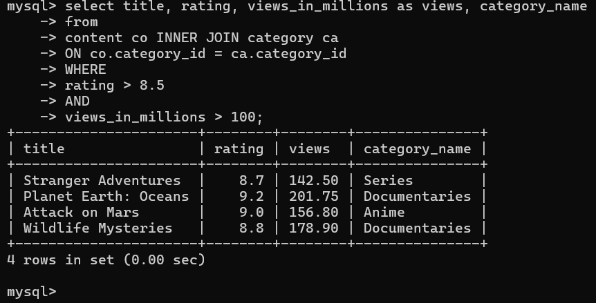
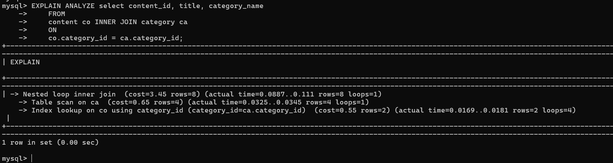
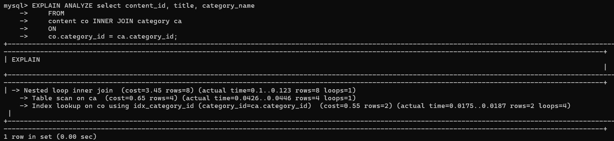

# Pre-KDU-2026
PRE KDU 

## Database-Module Tasks
### Querries
1.  select content_id, title, category_name
    FROM
    content co INNER JOIN category ca
    ON
    co.category_id = ca.category_id;

2.  select title, rating, views_in_millions from content
    order by views_in_millions DESC;

3.  select ca.category_name, AVG(rating) as average_rating
    from
    content co INNER JOIN category ca
    ON co.category_id = ca.category_id
    GROUP BY co.category_id;

4.  select title, rating, views_in_millions as views, category_name
    from
    content co INNER JOIN category ca
    ON co.category_id = ca.category_id
    WHERE
    rating > 8.5
    AND
    views_in_millions > 100;

5.  Before index creation

    After Index creation

    Before creation of the index, Index Lookup was used on category_id, but after the creation of the index it was used directly on the category_id. Performance didnot vary much and had a simillar performance becuase of the size of the tables, therefore I feel the performance would have been significant if the size was larger.

### Questions
1.  Foreign keys are used to map different tables with particular columns which makes the database relational.
    Inserting a category_id=999(which is not in the category) will result in a refrential integrity constraint voilatoin. Here when there is a foreign key constraint it should either be the values which exist in the relational table or a NULL value else it raises an error.

2.  A - Atomicity, it makes sure that the entire work happens or nothing is executed.
    C - Consistency, makes sure that the databsase is consistent throughout the changes.
    I - Isolation, it offers transactions which can execute without effecting the other.
    D - Durability, handles system failures.

    With the given situation, I don't think there will be anything wrong with all the ACID principles but there might be an issue with consistency, but eventually even that will be sorted. 

3.  Creating an index on category_id makes the where and join clauses execute with better performance. 
    The index created on category_id makes a b-tree index, therefore each category can be grouped easily and filtered with better runtime.

    