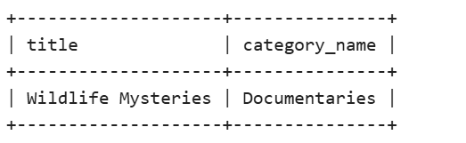
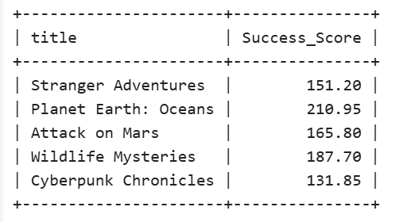

Request A :

        select 
        title, category_name
        from
        content con INNER JOIN category cat
        ON con.category_id=cat.category_id
        where
        rating > 8 AND release_year=2024 AND category_name="Documentaries";

Request 2 :

        select title, (rating+views_in_millions) as Success_Score 
        FROM 
        content
        where (rating+views_in_millions)>100;

